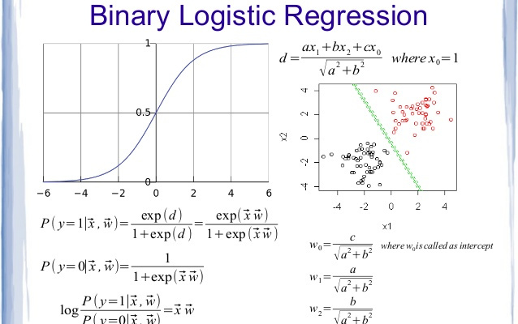
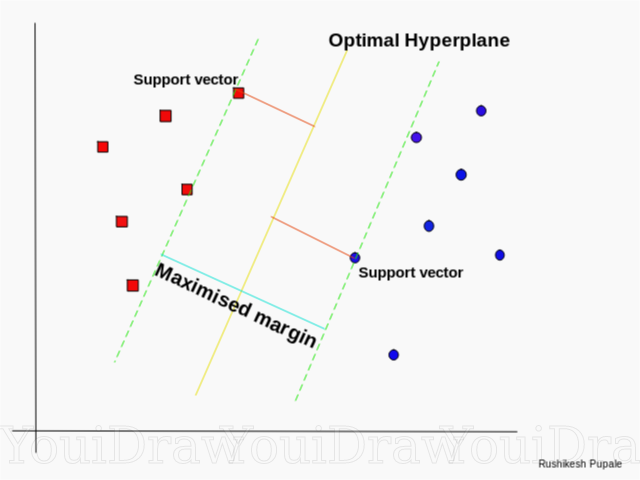
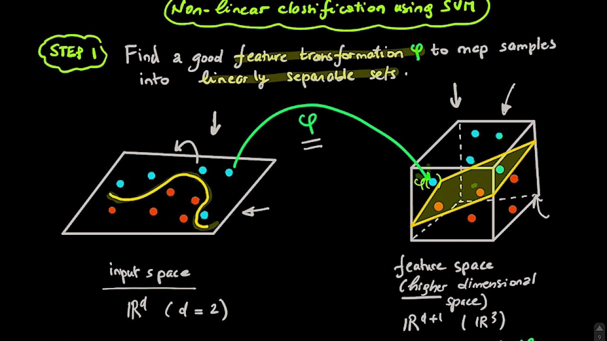
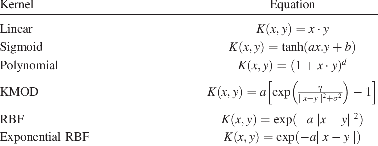
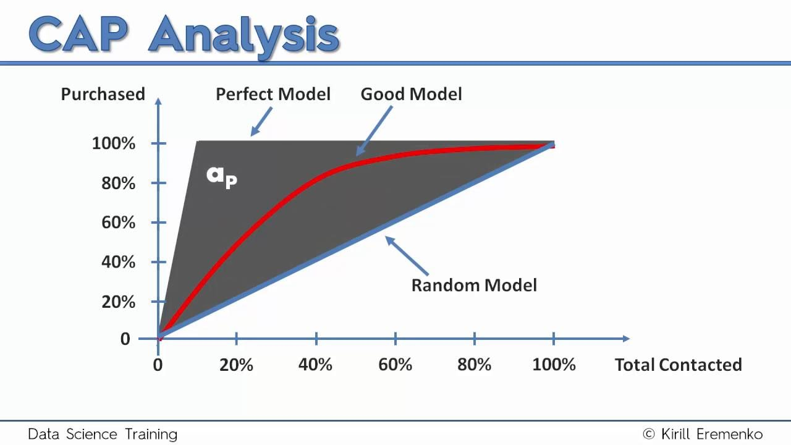

# Classification Notes

## Logistic Regression
Logistic regression is linear classifier & returns probabilities

## K-Nearest Neighbor  
The KNN algorithm assumes that similar things exist in close proximity. In other words, similar things are near to 
each other, calculating the distance between points on a graph

Steps:
1. Initialize K to a chosen number of neighbors, **default may be = 5**
2. Take the K nearest neighbour for the new data point, according to the Eculidean distance
3. Among these K neighbour, count the number of data points in each category 
4. Assign the new data point to the category where we counted the most neighbours

## Support Vector Machine
Support vector machine is highly preferred by many as it produces **significant accuracy** with less computation power. 

The objective of the support vector machine algorithm is to find a hyperplane in an N-dimensional space(N — the number 
of features) that distinctly classifies the data points & maximum margin, i.e the maximum distance between data points 
of both classes

Hyperplanes are decision boundaries that help classify the data points. Data points falling on either side of 
the hyperplane can be attributed to different classes. Also, the dimension of the hyperplane depends upon the number of
features. If the number of input features is 2, then the hyperplane is just a line. If the number of input 
features is 3, then the hyperplane becomes a two-dimensional plane

In SVM, we take the output of the linear function and if that output is greater than 1, we identify it with one class
and if the output is -1, we identify is with another class. Since the threshold values are changed to 1 and -1 in 
SVM, we obtain this reinforcement range of values([-1,1]) which acts as margin

The are two main types of classification SVM algorithms Hard Margin and Soft Margin:
- **Hard Margin:** aims to find the best hyperplane without tolerating any form of mis-classification.
- **Soft Margin:** we add a degree of tolerance in SVM. In this way we allow the model to voluntary misclassify a few data
points if that can lead to identifying a hyperplane able to generalise better to unseen data.

#### Kernel Trick
If the data we are working with is not linearly separable (therefore leading to poor linear SVM 
classification results), it is possible to apply a technique known as the Kernel Trick. This method is able to map our 
non-linear separable data into a higher dimensional space, making our data linearly separable. Using this new 
dimensional space SVM can then be easily implemented 

Types of Kernels:

## Naive Bayes 
A Naive Bayes classifier is a probabilistic machine learning model that’s used for classification task. The crux of the
classifier is based on the **Bayes theorem**

We make two assumptions here: 
1. Consider that these predictors are **independent**, that's why the algorithm is called *Naive*
2. All the predictors have an equal effect on the outcome, (Marginal likelihood is similar)

Types of Naive Bayes Classifier:
1. Multinomial Naive Bayes:
This is mostly used for document classification problem, i.e whether a document belongs to the category of sports, 
politics, technology etc. The features/predictors used by the classifier are the frequency of the words present in the 
document

2. Bernoulli Naive Bayes:
This is similar to the multinomial naive bayes but the predictors are boolean variables. The parameters that we use to
predict the class variable take up only values yes or no

3. Gaussian Naive Bayes:
When the predictors take up a continuous value and are not discrete, we assume that these values are sampled from a 
gaussian distribution

## Evaluating Classification Models Performance

#### Confusion matrix
A confusion matrix is a table that is often used to describe the **performance** ,of a classification model 
(or "classifier") on a set of test data for which the true values are known.

> Let's now define the most basic terms, which are whole numbers (not rates):
> - true positives (TP): These are cases in which we predicted yes (they have the disease), and they do have the disease.
> - true negatives (TN): We predicted no, and they don't have the disease.
> - false positives (FP): We predicted yes, but they don't actually have the disease. (Also known as a "Type I error.")
> - false negatives (FN): We predicted no, but they actually do have the disease. (Also known as a "Type II error.")

This is a list of rates that are often computed from a confusion matrix for a binary classifier:

- Accuracy: Overall, how often is the classifier correct? `(TP+TN)/total`

- Mis-classification Rate: Overall, how often is it wrong? `(FP+FN)/total`, equivalent to 1 minus Accuracy also known as "Error Rate"

- True Positive Rate: When it's actually yes, how often does it predict yes? `TP/actual yes`, also known as "Sensitivity" or "Recall"

- False Positive Rate: When it's actually no, how often does it predict yes? `FP/actual no`

- True Negative Rate: When it's actually no, how often does it predict no? `TN/actual no`

- Precision: When it predicts yes, how often is it correct? `TP/predicted yes`
 
- Prevalence: How often does the yes condition actually occur in our sample? `actual yes/total`

### Cumulative Accuracy Profile (CAP) Curve
The CAP Curve tries to analyse how to effectively identify all data points of a given class using minimum number of tries

#### CAP Analysis using Area Under Curve
We calculate the Accuracy Rate using the following steps:
1. Calculate the area under the perfect model (aP) till the random model (a)
2. Calculate the area under the prediction model (aR) till the random model (a)
3. Calculate Accuracy Rate (AR) = aR / aP

> **The closer the Accuracy Rate is to the 1, better is the model**

#### CAP Analysis using Plot
Another method to analyse the CAP Curve involves reading the plot we generated above. Steps for the same are:
1. Draw a vertical line at 50% from the x-axis till it crosses the model plot
2. At the point, where the vertical line cuts the trained model, draw a horizontal line such that it cuts the y-axis
3. Calculate the percentage of class 1 identified with respect to the total count of class 1 labels

Percentage analysis: 
1. Less than 60%: Rubbish Model
2. 60% — 70%: Poor Model
3. 70% — 80%: Good Model
4. 80% — 90%: Very Good Model
5. More than 90%: Too Good to be True, may be **over fitting**
