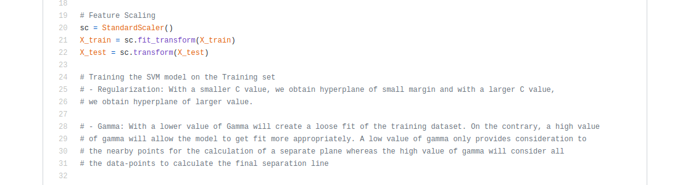
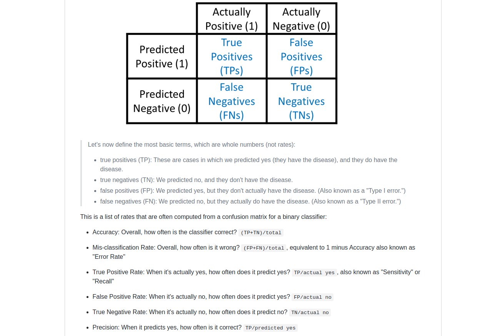

# Machine-Learning-From-A-Z

- [x] Some sections have their own notes.md file which includes some explanations & notes that 
have been taken during the course from various documentations 
- [x] Perfectly Commented code 
- [x] Additional projects 
- [x] Basic AI tips & expressions in **AI for Everyone.md** file

## Code Comments Examples
**Data pre-processing comment snippet** 

**Classification model (SVM) comment snippet** 

## Classification

### Classification Notes Examples 
**Example 1:**

**Example 2:**

### Classification Pros & Cons

## Regression
### Regression Notes Examples
**Example 1:**

### Regression Pros & Cons

